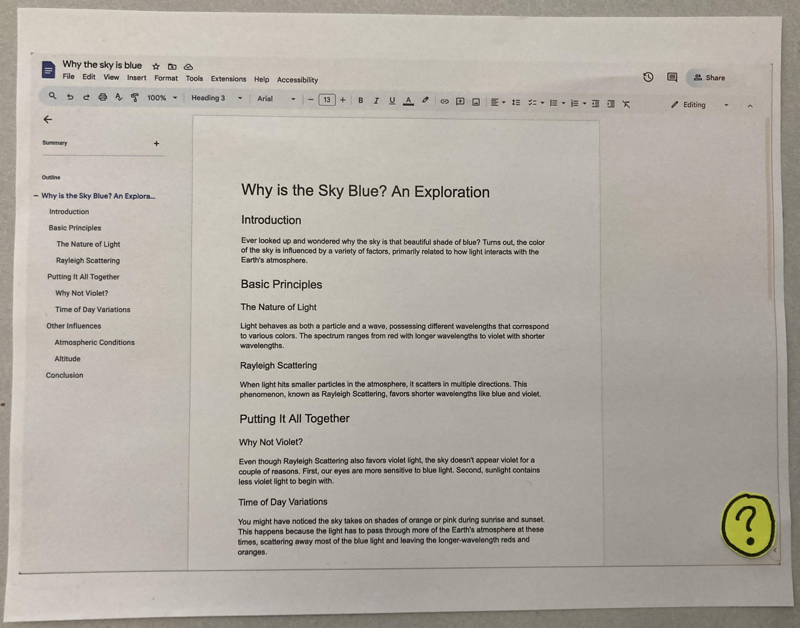

## Introduction

Now that we’ve learned about our users, this phase is all about proposing and prototyping a solution. We reflected on all the information we gathered in the prior phase to assess the needs of our users. We then came up with ideas and grouped them into similar categories. Themes that stood out to us, such as user cheat sheets, were the basis of our design sketches. We picked three sketches to consider more deeply before ultimately settling on one. We spent time solidifying this solution by creating a user flow diagram and making paper prototypes. Finally, we tested one of these prototypes with a potential user which provided us with insights for the next development phase. The following report documents this phase’s process in more detail.

## Needs Assessment Overview

The interface should be familiar and easy to find so older adults can adopt it with little trouble. During interviews, we learned that older adults often do not know how to use most of the features of many software applications, including email, texting, banking, and word processing. Several people we talked to reference paper cheat sheets for any task they do not do very often. Our software would make cheat sheets available in a familiar format for any new application or task at the click of a button. Hopefully, using our software would take the place of asking more tech-savvy people for help, which can feel embarrassing for older adults and make them feel incompetent.

## Portfolio of Initial Design Ideas

Before we began making our ideas more concrete, we wanted to identify common themes in the struggles older adults face when working with existing interfaces. Once we knew what key highlights connect older adults, our team sat down individually and wrote general ideas that could address problems in the space we identified. Then we came together and tried to group similar ideas.

_Portfolio of ideas from our individual brainstorming_

Among these were an interactive physical calendar to help older adults remember key information throughout the week; a “super-format” that can be applied to all websites so the user interaction with it is always the same; or a cheat sheet generator that can tell users how to interact with their needed websites in a format they’re used to. While broad, these ideas are still at their core attempting to solve a lack of technological context that older adults generally have. This board was the origin of our 3 main ideas.

## Refinement & Selection Process

From our larger portfolio of ideas, the 3 solutions we chose to move forward with are:

1. **Consumer Reports:** a [Consumer Reports](https://www.consumerreports.org/)-style magazine with quantitative app comparisons and reviews, tips and tricks, and new app recommendations.
2. **Easy Mode:** a setting to create larger icons, bigger font, and fewer buttons on software to make it simpler to use.
3. **Cheat Sheets:** infographic-style explainers for applications, including keyboard shortcuts and paths to common actions.

Before diving into our discussions, we outlined a few criteria that would be critical to our evaluation of each idea:

1. **Alignment with the Primary Goal:** How closely does the solution align with our primary objective of simplifying technology use for older adults?
2. **Impact: **Does the solution have the potential to make a significant positive difference in user experience?
3. **Innovation: **Does the solution provide a fresh or unique approach, or does it reiterate existing solutions?
4. **Trade Offs: **What are the pitfalls of each design and how would they unintentionally complicate technology for older adults or introduce unnecessary friction into the user experience?

With these criteria in mind, each team member made concept sketches for what each of these solutions could look like. We then reconvened as a group and discussed each solution in more detail, discussing how likely they are to realistically improve the usability of technology for older adults. We ended up eliminating Easy Mode and Consumer Reports.

_Concept sketches for top 3 solutions_

For Easy Mode, we felt that it would be difficult to specifically realize this over a broad spectrum of technology. It was over-scoped and wouldn’t allow us to go deep on user needs. Additionally, there are design accessibility guidelines that already exist to make certain interfaces “easier” to use, so we didn’t feel that this idea would make a big enough difference.

For Consumer Reports, we realized that while providing older adults a way to compare the ease of use of different technologies, it didn't really address our main goal of directly making technology simpler for them to use. However, we spoke heavily about how helpful the tips and tricks would be, and ended up weaving that into our final idea.

We chose to proceed with the Cheat Sheets idea. We noticed many creative ways to incorporate cheat sheets into how older adults use technology, and we believed it would make a big and quick difference.

## Chosen Design Approach

Our chosen design is an operating system (OS) feature (for desktop or iPad) which gives users step-by-step instructions for tasks in various applications. An easily accessible button, always on display regardless of the screen's status (or even as a physical button on the device), activates a small pop-up. This pop-up prompts the user to type in what they want to do. The software then uses a language model to interpret this input, translating user-friendly phrases like “I want to put numbers in front of the paragraphs” to application-specific terms like “Do you want to format the paragraphs as a numbered list?”. Subsequently, it highlights the necessary buttons for the user to click in sequence.

If we already know what the user wants to do, we know what keystrokes they need to press, and we have OS control, why don’t we just accomplish the task for them? The reason is twofold. First, it gives the user more agency, so they can make sure the correct thing is being done. Second, making the user follow the keystrokes themself will train them to better remember what to do the next time. In this way, our software is like training wheels for computer interfaces, which relates to our design goal of teaching older adults to become proficient with technology.

## Interaction Flow & Storyboard

We broke down every interaction a user might have with our product, from downloading the plug-in to using it to find tools or shortcuts. The legend became our best friend during this process, helping us differentiate user actions from product responses, and marking key decision points.

Below is our final user interaction flow:

<iframe style="border: 1px solid rgba(0, 0, 0, 0.1);" width="800" height="450" src="https://www.figma.com/embed?embed_host=share&url=https%3A%2F%2Fwww.figma.com%2Ffile%2FvS91Hko4nKLfTHJqJOs5bh%2Fuser-interaction-flow-for-cheat-sheet%3Ftype%3Dwhiteboard%26node-id%3D0%253A1%26t%3DcCnOFuQNw3uHSnmt-1" allowfullscreen></iframe>

Several crucial decisions shaped the flow. Here are a few that stood out to us:

* **Feedback-powered Guidance:** After user engagement, the product offers a feedback option in case the guide offered was not relevant. This system allows the product to provide new guides based on real-time user feedback, ensuring older adults can receive assistance in completing a task, even if they struggle to articulate what they need help with. The feedback mechanism should be very simple to avoid cluttering the interface.
* **Proactive Assistance:** Our product proactively suggests tools upon app or website access, preventing users from feeling disorientation. However, it's essential to maintain subtlety to avoid overwhelming or making users feel like they are being constantly monitored.

The completed user interaction flow acted as a roadmap for our paper prototype. It also helped the team understand how the product and user interact with one another, keeping us all on the same page.

## Low-Fidelity Paper Prototype

Our paper prototype is based on a backdrop of Google Docs, an example of an application certain older adults have described as confusing or overwhelming. We began with a screenshot and printed it out. Our user interaction begins by clicking or tapping on a floating icon in the bottom right corner when they need assistance.

Pressing the button opens a popup on screen with a search bar and some options recommended based on past user questions and common functionality for the current software. The format of this popup will likely change, and we’ve discussed modeling it more like Microsoft’s Copilot with a sidebar to the right. Regardless, clicking or tapping one of the existing options will close the popup and launch a series of tooltips for tasks such as changing the font.

The search bar is powered by generative AI and can engage in natural language questions. It confirms the desired task and communicates instructions through tooltips that pop up on screen. For example, if a user asks how to change the font it will explain how to expand the font drop down and change a font. If the user asks for handwritten fonts, it will walk through the same process as before and then continue by recommending handwritten fonts.

## Testing Outcomes & Feedback

**Testing Process & Users Involved**

We ran a paper prototype test with a user over Zoom. Of the multiple ways our product could look, we chose the version with a permanent sidebar and tooltips. We co-designed some of the language that would appear in the sidebar dialogue box and in the tooltips. The user suggested very verbose wording, such as “Click to the left of the lines you want to be numbered.” In the co-design, we also modified certain aspects of the interaction, including when the tooltips would appear and disappear and how the user would go back to a previous step.

**Key Takeaways from User Testing**

* Make the button for opening our software visible and friendly.
* Show all instructions in order in one place (for example, in the dialogue sidebar), so that it’s always clear which instruction comes next, in addition to providing tooltips.
* Only erase tooltips once all steps have been completed (where possible).
* Allow the user to erase tooltips in case they get in the way.
* When the user clicks a tooltip, it should automatically click the button the tooltip was pointing to.
* Allow the user to go back to previous steps.
* Give the tooltips well-defined arrows so the user can tell what it’s pointing to.

**Areas of Improvement Identified**

One concern we have going forward is that we want the interface to be as simple and minimalistic as possible in order to be usable. This means we might have to forgo features like explicit user feedback in order to make it more usable. We have to remember that we are billing this software as an accessibility plug-in, which means it may not make sense to be as full-featured or complex as we might have imagined.

## Key Insights & Lessons Learned

We saw that older adults lack the technological context that a lot of designers assume people using their products will have. This disconnect makes using software a passively (or actively) annoying experience, and makes it difficult to learn new tools since they can’t abstract their knowledge from one app to another. This seems to be the most central struggle, from which stems a myriad of others that inhibit older adults’ abilities to take advantage of many software tools available now.

Our team had a lengthy discussion about how well a solution to this on each platform would serve our user group’s core issue. A browser extension might work great if all the relevant information you need is contained in the browser, but what if you need help with Word? A physical magazine of cheat sheets where people can bookmark or tear out the pages they think are relevant, but how do you search through thousands of pages? Each of our platforms had their pros and cons, but an unintended trend was emerging–the core feature/thing our solution **needed** to do: Display information that is relevant to what the user is doing. In any medium we develop, it's vital that users can access and use information relevant to their tasks. Users open a new app or website with a specific task in mind. For a cheat sheet to be effective, it must assist them in achieving that particular goal and reduce any confusion in their experience.

## Conclusion (Sam)

Summary of Report Findings

Next Steps & Recommendations

## Appendix

### Effort Chart

 
